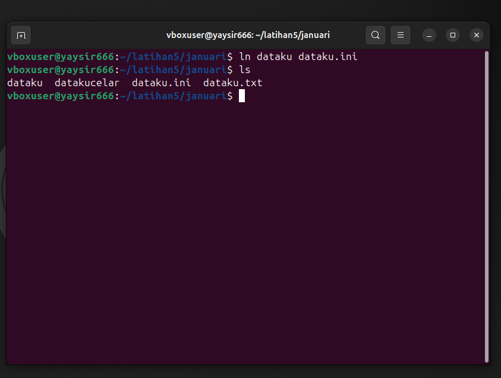
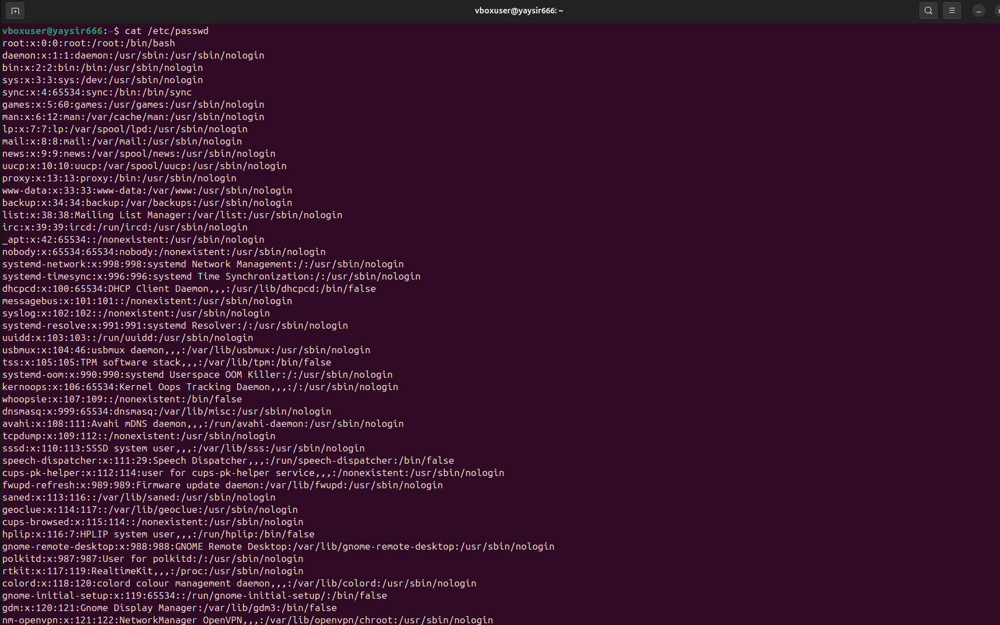
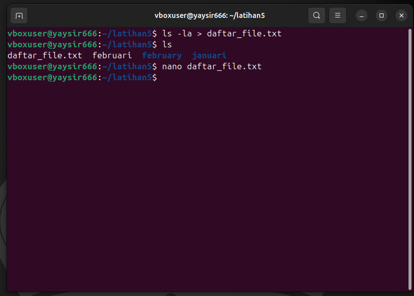
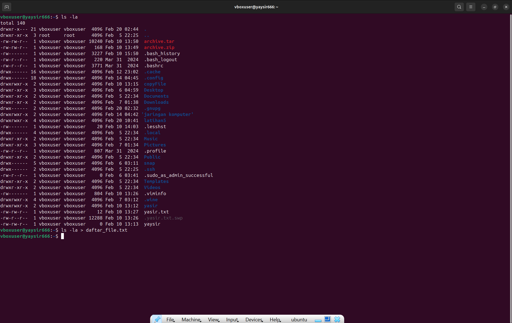
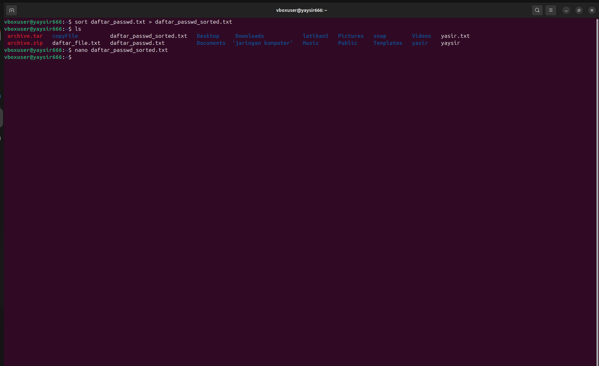
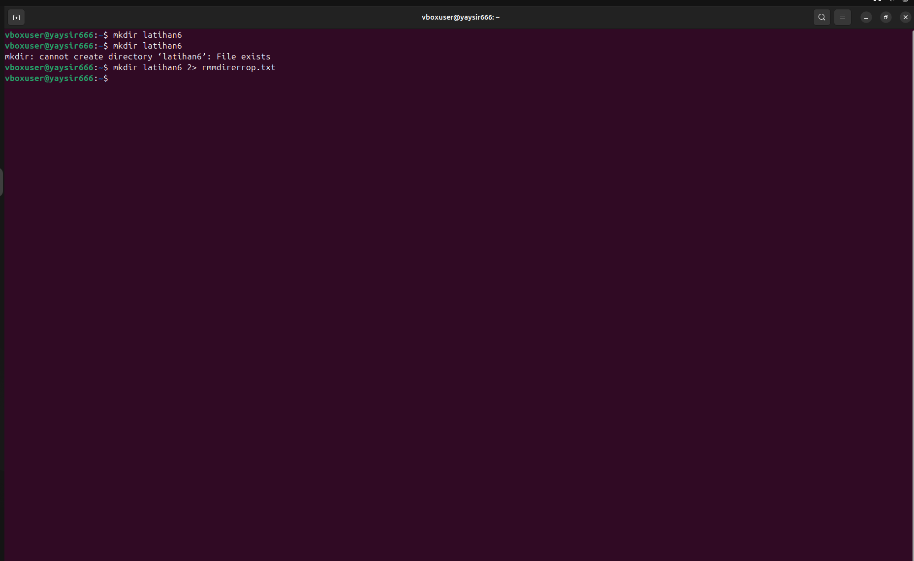
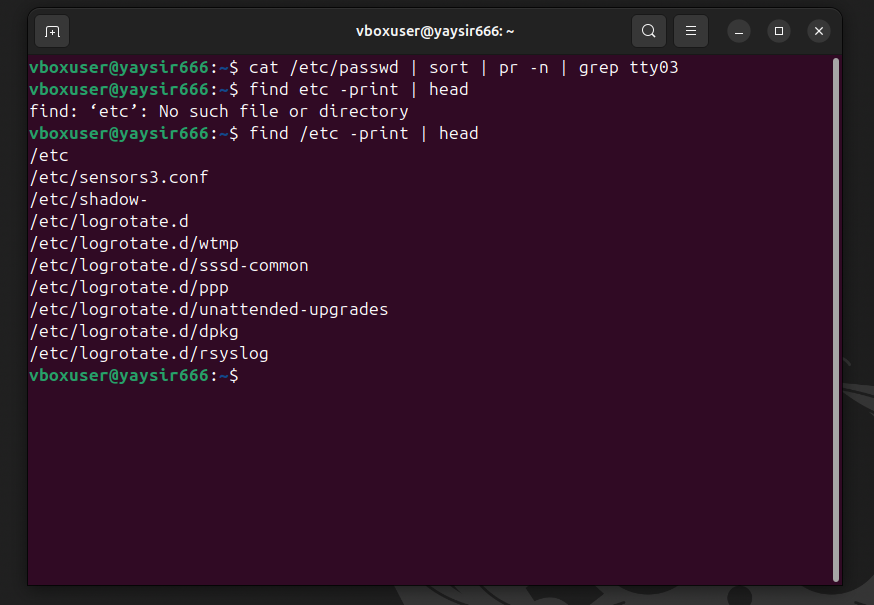
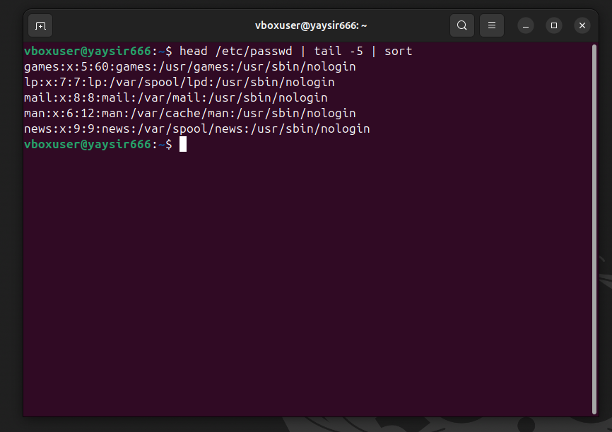

# yasyir__masyal_049_SO_laprak_4

<ol>
  <li>
    Melihat Daftar Lengkap di Direktori Aktif dan Membelokkan Output ke File Baru. Output disimpan di daftar_aktif.txt.
  </li>
  
  <li>
    Melihat Isi /etc/passwd dan Membelokkan Output tanpa Menghapus File Sebelumnya Output ditambahkan ke file tanpa menghapus isi sebelumnya.
  </li>
  
  <li>
    Mengurutkan Isi File dengan Input Redirection Isi file diurutkan dan ditampilkan di layar.
  </li>
  
  
  <li>
   Mengurutkan dan Menyimpan ke File Baru bernama baru.urut. Isi yang sudah diurutkan disimpan di baru urut.
  </li>
  
  <li>
    Membuat Direktori latihan6 Dua Kali dan Menyimpan Error ke rmdirerror.txt. Error disimpan di file rmdirerror.txt karena direktori sudah ada.
  </li>
  
  <li>
    Mengurutkan Kalimat Menggunakan Here Document. Kalimat diurutkan secara alfabetis dan ditampilkan di layar.
  </li>
  <li>
    Menghitung Jumlah Baris, Kata, dan Karakter dari baru.urut dan Menambahkannya ke File Baru. Jumlah baris, kata, dan karakter ditambahkan ke hasil_wc.txt.
  </li>
  
  <li>
    Menjalankan Perintah-Perintah Berikut dan Mengamati Hasilnya:
  </li>
    <ul>
      <li>Mencari tty03 di /etc/passwd. Mencari baris yang mengandung "tty03" setelah diurutkan.</li>
      <li>Menampilkan 10 Baris Pertama dari /etc. Menampilkan 10 hasil pertama dari pencarian di /etc. </li>
  
      <li> Menampilkan Baris 6-10 dari /etc/passwd yang Sudah Diurutkan. Menampilkan baris 6-10 setelah diurutkan.</li>
  
    </ul>
    <li>
    Menjalankan Perintah Kompleks dan Mengamati Hasilnya. Output dari who diurutkan, diformat, dan ditampilkan sebagian di layar.
  </li>
  
</ol>
